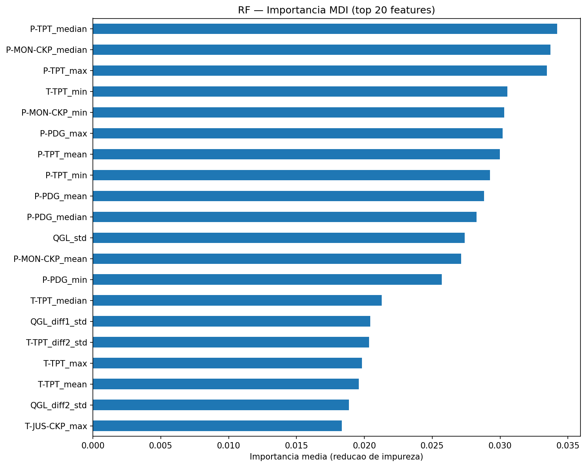
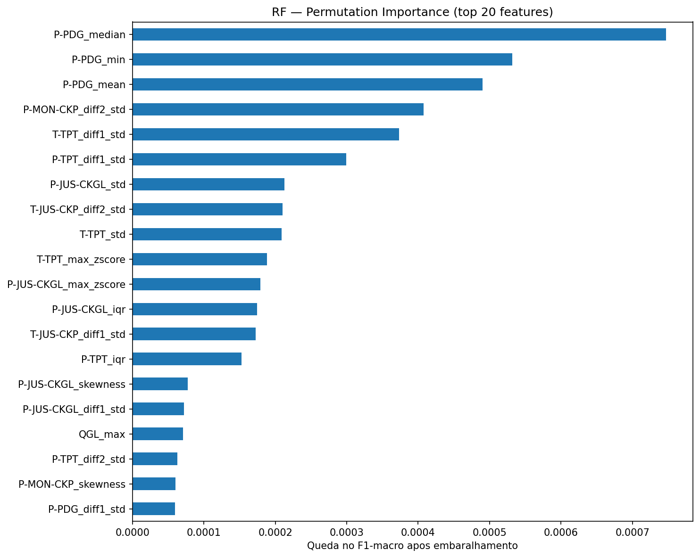
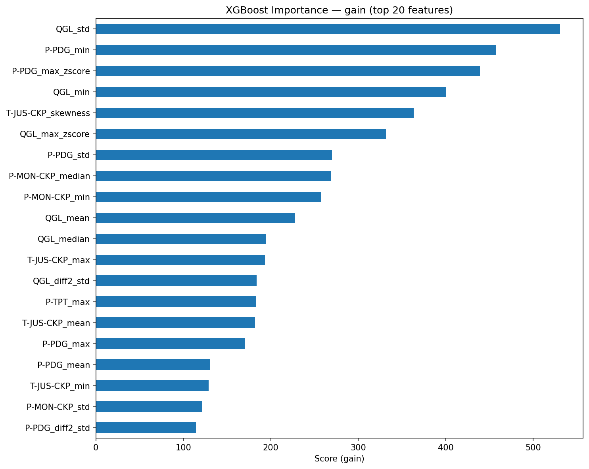
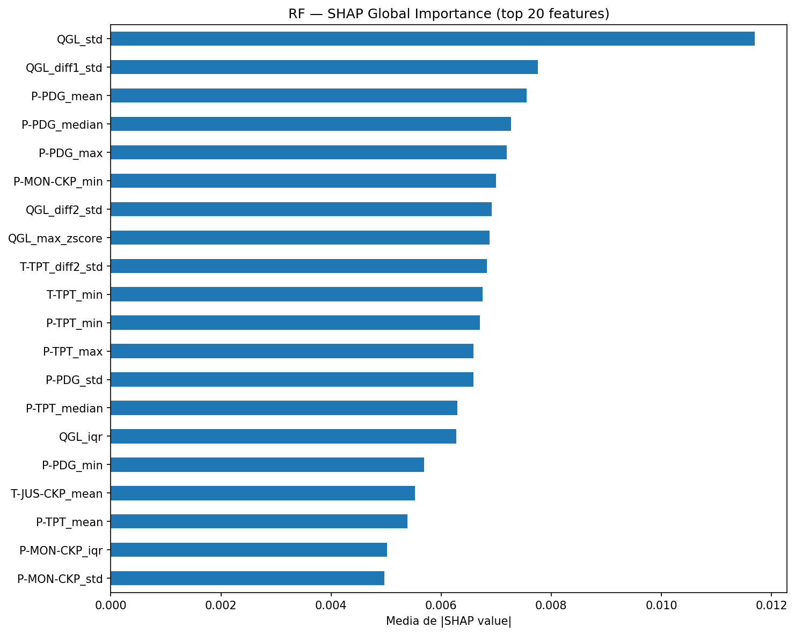
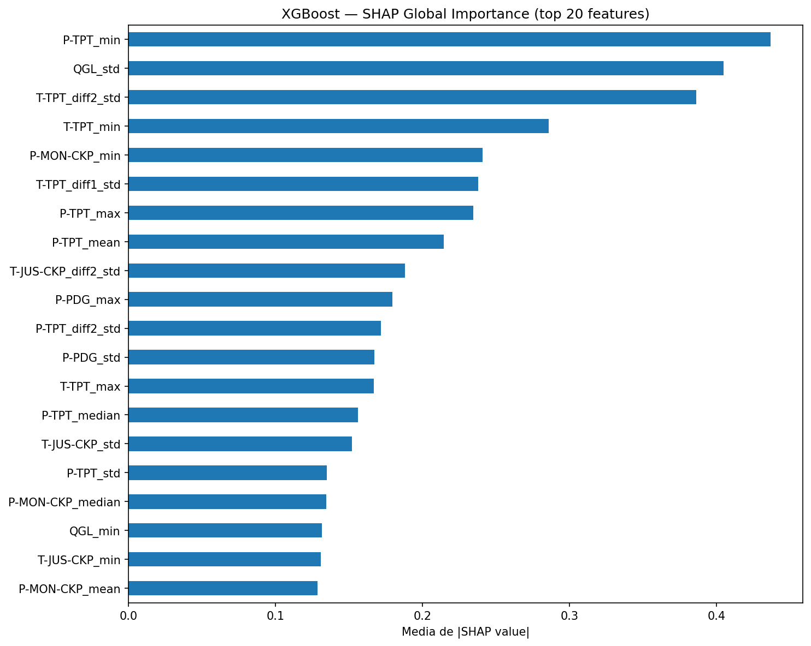

# Previsão de Falha a partir de Operação Normal

## Objetivo

Verificar se é possível prever **qual tipo de falha um poço vai desenvolver** usando apenas janelas em que ele ainda está operando normalmente. A pergunta central é:

> "Dado que o poço está operando normalmente agora, qual falha ele tende a desenvolver?"

## Metodologia

### Filtro de janelas

Somente janelas com `window_label == 0` (operação normal) foram utilizadas — transientes e eventos ativos foram descartados. Isso resulta em **102.040 janelas** de **1.117 instâncias**.

### Rótulo de predição

O rótulo de cada janela é a `fault_class` da instância à qual ela pertence, ou seja, o tipo de falha que aquele poço irá desenvolver. São 8 classes disponíveis (classes 3 e 4 não possuem janelas de operação normal no dataset):

| Classe | Evento |
|--------|--------|
| 0 | Operação normal (poço nunca desenvolve falha) |
| 1 | Aumento Abrupto de BSW |
| 2 | Fechamento Espúrio da DHSV |
| 5 | Perda Rápida de Produtividade |
| 6 | Restrição Rápida no PCK |
| 7 | Incrustação no PCK |
| 8 | Hidrato na Linha de Produção |
| 9 | Hidrato na Linha de Serviço |

> Classes 3 (Golfadas) e 4 (Instabilidade de Fluxo) estão ausentes pois suas instâncias no 3W não possuem período de operação normal gravado.

### Features

88 features estatísticas extraídas de janelas de 300 s, **sem filtragem de sinal** (`smooth_filter="none"`), sobre os 8 sensores do poço.

### Validação

`GroupKFold(n_splits=5)` por `instance_id` — janelas do mesmo poço nunca aparecem simultaneamente em treino e teste.

---

## Resultados

### Métricas Globais

| Métrica | Random Forest | XGBoost |
|---------|:---:|:---:|
| F1-macro (OOF) | 0,9148 | **0,9262** |
| F1-weighted | 0,9538 | **0,9620** |
| Acurácia | 0,9554 | **0,9627** |

### F1 por Classe

| Classe | Evento | RF | XGBoost |
|--------|--------|----|---------|
| 0 | Normal | 0,979 | **0,981** |
| 1 | BSW | **0,970** | 0,966 |
| 2 | DHSV | 0,914 | **0,979** |
| 5 | Prod. Rápida | 0,873 | **0,886** |
| 6 | PCK Restrição | **0,955** | 0,868 |
| 7 | PCK Incrustação | 0,950 | **0,959** |
| 8 | Hidrato Produção | 0,744 | **0,809** |
| 9 | Hidrato Serviço | 0,934 | **0,961** |

O XGBoost supera o RF em 6 das 8 classes. A maior diferença está na **DHSV (+0,065)** e no **Hidrato de Produção (+0,065)**. O RF leva vantagem apenas em BSW e PCK Restrição.

### Matrizes de Confusão

| RF | XGBoost |
|:---:|:---:|
|  |  |

---

## Interpretabilidade

Três métodos foram utilizados para entender quais features mais contribuem para as predições:

### 1. MDI — Mean Decrease in Impurity (RF)

Mede o quanto cada feature reduz a impureza (Gini) em média ao longo de todas as árvores da floresta. É rápido e embutido no modelo, mas tende a favorecer features com alta variância ou muitas categorias.

### 2. Permutation Importance (RF)

Embaralha os valores de cada feature e mede a queda no F1-macro. Mais robusto que o MDI para features correlacionadas, mas computacionalmente mais caro (10 repetições).

### 3. XGBoost Gain

Mede o ganho médio de precisão por cada divisão que utilizou aquela feature. Das três métricas nativas do XGBoost (weight, gain, cover), o **gain** é a mais informativa: uma feature pode ser usada poucas vezes (baixo weight) mas em divisões muito decisivas (alto gain).

### 4. SHAP — SHapley Additive exPlanations

Calcula a contribuição individual de cada feature para cada predição, com base na teoria dos jogos cooperativos. Diferente dos métodos anteriores, o SHAP mostra **direção** (se a feature empurra a predição para uma classe ou para outra) e é consistente entre modelos diferentes.

| RF | XGBoost |
|:---:|:---:|
|  |  |

---

## Observações

- **Hidrato na Linha de Produção (8)** tem o menor F1 nos dois modelos (RF: 0,744; XGBoost: 0,809), com recall sistematicamente baixo — os padrões de operação normal desses poços são os mais difíceis de separar dos poços genuinamente normais.
- **PCK Restrição (6)** é o único caso em que o RF (0,955) supera significativamente o XGBoost (0,868), com queda de precisão no XGBoost — possivelmente por desbalanceamento na divisão dos folds.
- O resultado geral indica que **padrões detectáveis já existem na fase de operação normal**, antes de qualquer transiente, para a maioria dos tipos de falha.
