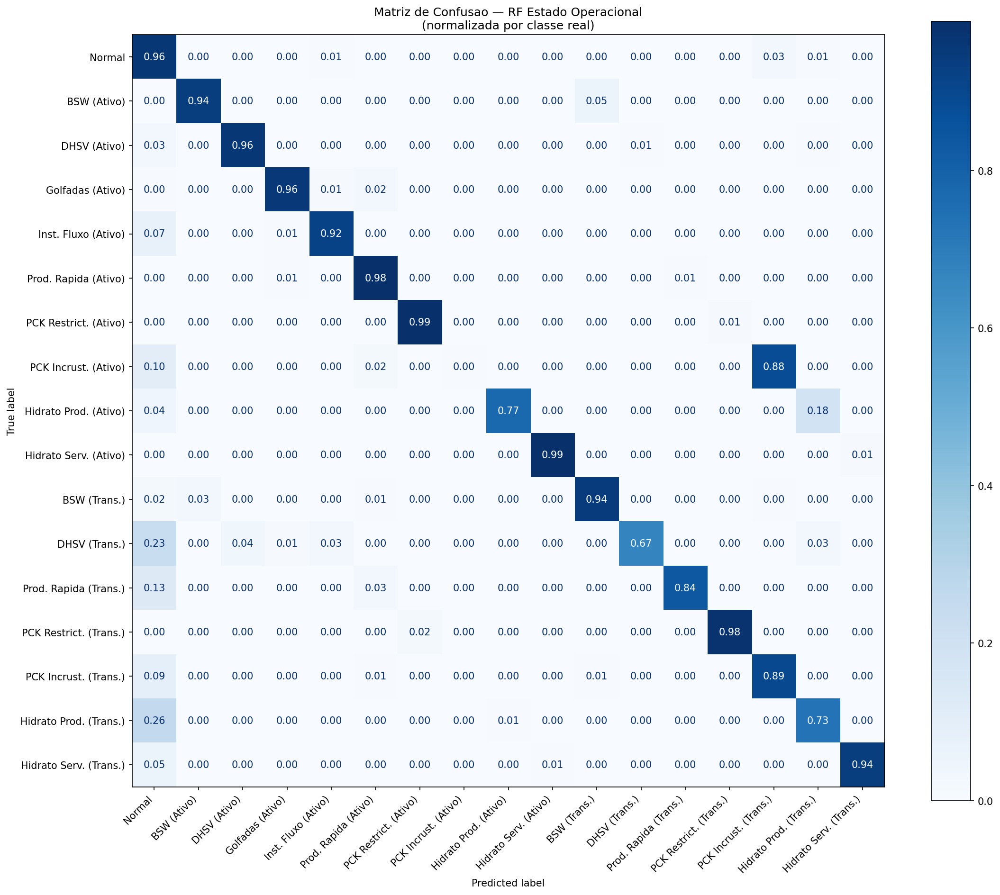
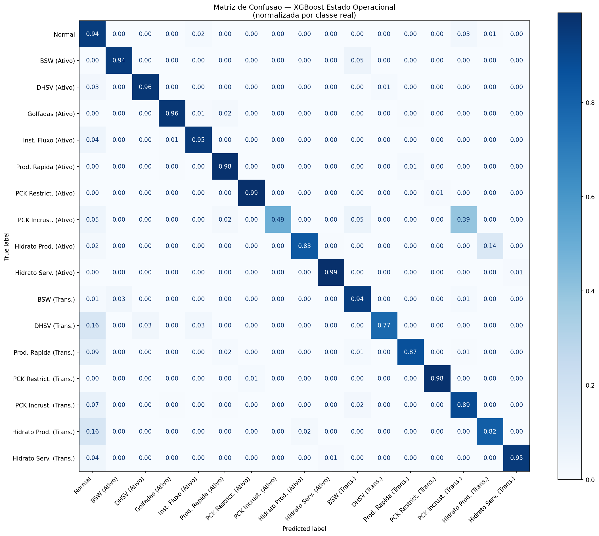
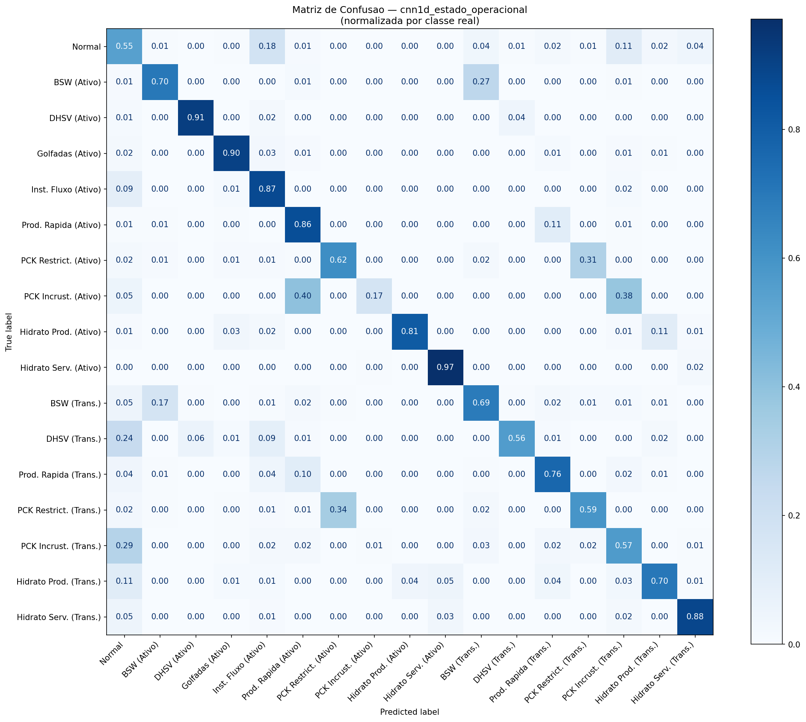

# Resultados dos Modelos Treinados

**Projeto:** TCC — Garantia de Escoamento com 3W Dataset (Petrobras)
**Validação:** GroupKFold (n_splits=5) por instance_id — sem data leakage entre poços
**Métrica principal:** F1-macro (penaliza erros em classes raras igualmente)

---

## Estado Operacional por Janela (17 classes)

Cada janela recebe a moda da coluna `class` dentro dela. Responde: "qual é o estado do poço agora?"
Classes: 0=Normal, 1–9=Evento Ativo, 101–109=Transiente (103 e 104 ausentes no dataset).

| Modelo | Filtro | F1-macro | F1-weighted | Accuracy | Data |
|--------|--------|:--------:|:-----------:|:--------:|------|
| RF Estado Operacional | Gaussiano | 0.8716 | 0.9308 | 0.9322 | 2026-04-27 04:25 |
| XGBoost Estado Operacional | Gaussiano | **0.9082** | 0.9361 | 0.9364 | 2026-04-27 13:02 |
| XGBoost Estado Operacional | Sem Filtro | 0.9065 | 0.9339 | 0.9345 | 2026-04-29 |
| **XGBoost Estado Operacional** | **Estatístico** | 0.9067 | **0.9401** | **0.9402** | 2026-04-29 |
| CNN-1D (FCN) | Gaussiano | 0.6685 | 0.7168 | 0.7107 | 2026-05-04 |

### Matrizes de Confusão 

**Random Forest:**

**XGBoost:**

---

## Contexto dos Datasets

| Item | Resultado |
|------|------------|
| Arquivo | `features_window_class.parquet` |
| Instâncias (poços) | 1.409 |
| Janelas totais | 449.397 |
| Features por janela | 88 |
| Classes | 17 |
| Janela | 300 s, passo 150 s |
| Normalização | Z-score por instância |

---

## Random Forest — Diagnóstico (10 classes)

**Arquivo:** `results/models/random_forest.joblib` | **Data:** 2026-04-26 19:01:32

### Melhores Hiperparâmetros
| Parâmetro | Valor | Descrição |
|-----------|-------|-----------|
| n_estimators | 100 | Número de árvores de decisão no ensemble. Mais árvores = mais estável, mas mais lento |
| max_depth | None | Profundidade máxima de cada árvore. `None` = cresce até separar todas as folhas (sem limite) |
| min_samples_leaf | 1 | Mínimo de amostras para uma folha existir. Valores maiores evitam overfitting |
| max_features | sqrt | Features consideradas em cada divisão: `sqrt(88) ≈ 9`. Introduz aleatoriedade entre as árvores |
| class_weight | balanced | Pesos inversamente proporcionais à frequência de cada classe — compensa o desbalanceamento automaticamente |

### Métricas (GroupKFold n=5)
| Métrica | Valor |
|---------|-------|
| F1-macro (CV best) | **0.9558** |
| F1-macro (concat folds) | 0.9529 |
| F1-weighted | 0.9577 |
| Accuracy | 0.9579 |

### Por Classe
| Classe | Evento | Precision | Recall | F1 | Suporte |
|--------|--------|:---------:|:------:|:--:|--------:|
| 0 | Normal | 0.9217 | 0.9752 | 0.9477 | 72.148 |
| 1 | Aumento Abrupto de BSW | 0.9724 | 0.9780 | 0.9752 | 60.497 |
| 2 | Fechamento Espúrio da DHSV | 0.9832 | 0.8943 | 0.9366 | 4.767 |
| 3 | Golfadas Severas | 0.9752 | 0.9415 | 0.9581 | 32.841 |
| 4 | Instabilidade de Fluxo | 0.9409 | 0.9229 | 0.9318 | 18.218 |
| 5 | Perda Rápida de Produtividade | 0.9745 | 0.9633 | 0.9689 | 88.079 |
| 6 | Restrição Rápida no PCK | **0.9997** | 0.9891 | **0.9944** | 38.783 |
| 7 | Incrustação no PCK | 0.9818 | 0.9488 | 0.9650 | 58.099 |
| 8 | Hidrato na Linha de Produção | 0.9704 | 0.8406 | 0.9008 | 37.826 |
| 9 | Hidrato na Linha de Serviço | 0.9083 | 0.9961 | 0.9502 | 60.219 |

### Observações
- Melhor: Classe 6 (PCK Restrição) — F1=0.9944
- Mais difícil: Classe 2 (DHSV) — F1=0.9366, menor suporte (4.767 janelas)
- Todas as 10 classes acima de F1=0.90 — desempenho muito homogêneo

---

## Random Forest — Estado Operacional (17 classes)

**Arquivo:** `results/models/rf_window_class.joblib` | **Data:** 2026-04-27 04:25:09

### Melhores Hiperparâmetros
| Parâmetro | Valor | Descrição |
|-----------|-------|-----------|
| n_estimators | 200 | Número de árvores. O dobro do RF de diagnóstico — problema mais complexo com 17 classes |
| max_depth | None | Sem limite de profundidade — árvores crescem até isolar cada folha |
| min_samples_leaf | 2 | Mínimo de 2 amostras por folha — leve regularização contra overfitting |
| max_features | sqrt | `sqrt(88) ≈ 9` features por divisão |
| class_weight | balanced | Pesos automáticos por classe — essencial com desbalanceamento de até 112:1 |

### Métricas (GroupKFold n=5)
| Métrica | Valor |
|---------|-------|
| F1-macro (CV best) | 0.8827 |
| F1-macro (concat folds) | 0.8716 |
| F1-weighted | 0.9308 |
| Accuracy | 0.9322 |

### Por Classe
| Classe | Estado | Precision | Recall | F1 | Suporte |
|--------|--------|:---------:|:------:|:--:|--------:|
| 0 | Normal | 0.8510 | 0.9599 | 0.9022 | 102.040 |
| 1 | BSW (Ativo) | 0.9462 | 0.9358 | 0.9410 | 19.305 |
| 2 | DHSV (Ativo) | 0.9855 | 0.9593 | 0.9722 | 2.409 |
| 3 | Golfadas (Ativo) | 0.9703 | 0.9580 | 0.9641 | 32.105 |
| 4 | Inst. Fluxo (Ativo) | 0.9199 | 0.9178 | 0.9188 | 12.238 |
| 5 | Prod. Rápida (Ativo) | 0.9740 | 0.9837 | 0.9789 | 70.018 |
| 6 | PCK Restrict. (Ativo) | 0.9925 | 0.9883 | 0.9904 | 25.645 |
| **7** | **PCK Incrust. (Ativo)** | 0.3333 | 0.0044 | **0.0086** | **914** |
| 8 | Hidrato Prod. (Ativo) | 0.9566 | 0.7727 | 0.8548 | 4.817 |
| 9 | Hidrato Serv. (Ativo) | 0.9923 | 0.9895 | 0.9909 | 21.122 |
| 101 | BSW (Trans.) | 0.9540 | 0.9444 | 0.9492 | 34.991 |
| 102 | DHSV (Trans.) | 0.9600 | 0.6660 | 0.7864 | 937 |
| 105 | Prod. Rápida (Trans.) | 0.9563 | 0.8372 | 0.8928 | 16.045 |
| 106 | PCK Restrict. (Trans.) | 0.9776 | 0.9768 | 0.9772 | 10.181 |
| 107 | PCK Incrust. (Trans.) | 0.9219 | 0.8932 | 0.9073 | 48.982 |
| 108 | Hidrato Prod. (Trans.) | 0.9306 | 0.7336 | 0.8204 | 27.934 |
| 109 | Hidrato Serv. (Trans.) | 0.9867 | 0.9377 | 0.9616 | 19.714 |

### Observações
- **Classe 7:** F1=0.009 — 914 janelas (0.2%), quase não detectada
- **Classe 102:** F1=0.786 — 937 janelas (0.2%), segunda mais difícil
- Transientes geralmente têm F1 menor que ativos — comportamento esperado

---

## XGBoost — Estado Operacional (17 classes)

**Arquivo:** `results/models/xgboost_window_class.joblib` | **Data:** 2026-04-27 13:02:37

### Melhores Hiperparâmetros
| Parâmetro | Valor | Descrição |
|-----------|-------|-----------|
| n_estimators | 500 | Número de rodadas de boosting (árvores sequenciais). Mais alto que o RF pois cada árvore é mais simples (max_depth=4) |
| max_depth | 4 | Profundidade máxima de cada árvore. Árvores rasas (3–6) são típicas no XGBoost — o poder vem da quantidade, não da profundidade individual |
| learning_rate | 0.1 | Fator de encolhimento (shrinkage): cada nova árvore contribui com apenas 10% do seu peso. Evita que uma única árvore domine o modelo |
| subsample | 0.8 | Fração das amostras usada para treinar cada árvore (80%). Introduz aleatoriedade e reduz overfitting, similar ao bagging do RF |
| colsample_bytree | 1.0 | Fração das features usada em cada árvore (100% = todas as 88 features). Diferente do RF que usa só sqrt(88) |
| min_child_weight | 3 | Soma mínima dos pesos de amostras em um nó folha. Evita divisões em nós com pouquíssimas amostras |
| sample_weight | balanced | Pesos por amostra calculados por `compute_sample_weight('balanced', y)` — equivalente ao `class_weight='balanced'` do sklearn, aplicado manualmente pois o XGBoost não tem esse parâmetro |

### Métricas (GroupKFold n=5)
| Métrica | RF | **XGBoost** | Δ |
|---------|:--:|:-----------:|:-:|
| F1-macro (CV best) | 0.8827 | **0.8866** | +0.0039 |
| F1-macro (concat folds) | 0.8716 | **0.9082** | +0.0366 |
| F1-weighted | 0.9308 | **0.9361** | +0.0053 |
| Accuracy | 0.9322 | **0.9364** | +0.0042 |

### Por Classe — XGBoost vs RF
| Classe | Estado | F1 XGB | F1 RF | Δ |
|--------|--------|:------:|:-----:|:-:|
| 0 | Normal | **0.9145** | 0.9022 | +0.0123 |
| 1 | BSW (Ativo) | **0.9389** | 0.9410 | -0.0021 |
| 2 | DHSV (Ativo) | **0.9729** | 0.9722 | +0.0007 |
| 3 | Golfadas (Ativo) | **0.9674** | 0.9641 | +0.0033 |
| 4 | Inst. Fluxo (Ativo) | 0.8988 | **0.9188** | -0.0200 |
| 5 | Prod. Rápida (Ativo) | **0.9819** | 0.9789 | +0.0030 |
| 6 | PCK Restrict. (Ativo) | **0.9901** | 0.9904 | -0.0003 |
| **7** | **PCK Incrust. (Ativo)** | **0.5712** | 0.0086 | **+0.5626** |
| 8 | Hidrato Prod. (Ativo) | **0.8497** | 0.8548 | -0.0051 |
| 9 | Hidrato Serv. (Ativo) | **0.9895** | 0.9909 | -0.0014 |
| 101 | BSW (Trans.) | 0.9289 | **0.9492** | -0.0203 |
| 102 | DHSV (Trans.) | **0.8285** | 0.7864 | +0.0421 |
| 105 | Prod. Rápida (Trans.) | **0.8899** | 0.8928 | -0.0029 |
| 106 | PCK Restrict. (Trans.) | **0.9775** | 0.9772 | +0.0003 |
| 107 | PCK Incrust. (Trans.) | **0.9047** | 0.9073 | -0.0026 |
| 108 | Hidrato Prod. (Trans.) | **0.8724** | 0.8204 | +0.0520 |
| 109 | Hidrato Serv. (Trans.) | **0.9628** | 0.9616 | +0.0012 |

### Observações
- **Maior ganho — Classe 7 (PCK Incrustação Ativo):** F1 saltou de 0.009 para **0.571** — o XGBoost consegue detectar parcialmente essa classe extremamente rara que o RF ignorava completamente
- **Classe 102 (DHSV Trans.):** melhora de 0.786 → 0.828 (+0.042)
- **Classe 108 (Hidrato Prod. Trans.):** melhora de 0.820 → 0.872 (+0.052)
- Pequenas regressões em alguns transientes (101, 104) — tradeoff esperado

---

## Validação: Nested CV vs Flat CV — Random Forest 

**Objetivo:** Quantificar o viés introduzido pela seleção de hiperparâmetros no flat CV.
**Configuração:** Outer GroupKFold(5) · Inner GroupKFold(3) · N\_ITER=20 · mesmo grid que o flat CV
**Total de treinamentos:** 300 · **Duração:** ~5h55min (13:27 → 19:22)

### Scores por fold externo

| Fold | Inner F1 (busca) | **Outer F1 (avaliação)** |
|:----:|:----------------:|:------------------------:|
| 1/5 | 0.8599 | 0.8883 |
| 2/5 | 0.8620 | 0.8415 |
| 3/5 | 0.8777 | 0.8743 |
| 4/5 | 0.8710 | 0.8624 |
| 5/5 | 0.8808 | 0.8996 |

| Método | F1-macro | Desvio padrão |
|--------|:--------:|:-------------:|
| Flat CV (GroupKFold 5) | **0.8827** | — |
| **Nested CV** | **0.8732** | **±0.0202** |
| Diferença | −0.0095 | — |

O flat CV superestima o desempenho real em **0,95%** de F1-macro — dentro do intervalo teórico esperado de 1–2% para viés de seleção de hiperparâmetros.

### F1 médio por classe — Nested CV vs Flat CV

| Classe | Estado | Nested CV | Flat CV | Δ |
|--------|--------|:---------:|:-------:|:-:|
| 0 | Normal | 0.9047 | 0.9022 | +0.0025 |
| 1 | BSW (Ativo) | 0.9416 | 0.9410 | +0.0006 |
| 2 | DHSV (Ativo) | 0.9716 | 0.9722 | −0.0006 |
| 3 | Golfadas (Ativo) | 0.9625 | 0.9641 | −0.0016 |
| 4 | Inst. Fluxo (Ativo) | 0.9160 | 0.9188 | −0.0028 |
| 5 | Prod. Rápida (Ativo) | 0.9788 | 0.9789 | −0.0001 |
| 6 | PCK Restrict. (Ativo) | 0.9904 | 0.9904 | 0.0000 |
| **7** | **PCK Incrust. (Ativo)** | **0.0048** | **0.0086** | −0.0038 |
| 8 | Hidrato Prod. (Ativo) | 0.8595 | 0.8548 | +0.0047 |
| 9 | Hidrato Serv. (Ativo) | 0.9910 | 0.9909 | +0.0001 |
| 101 | BSW (Trans.) | 0.9476 | 0.9492 | −0.0016 |
| 102 | DHSV (Trans.) | 0.7935 | 0.7864 | +0.0071 |
| 105 | Prod. Rápida (Trans.) | 0.8956 | 0.8928 | +0.0028 |
| 106 | PCK Restrict. (Trans.) | 0.9770 | 0.9772 | −0.0002 |
| 107 | PCK Incrust. (Trans.) | 0.9006 | 0.9073 | −0.0067 |
| 108 | Hidrato Prod. (Trans.) | 0.8459 | 0.8204 | **+0.0255** |
| 109 | Hidrato Serv. (Trans.) | 0.9632 | 0.9616 | +0.0016 |

### Conclusões

- O viés de seleção de hiperparâmetros é **real mas pequeno**: −0,95% de F1-macro
- **Nenhuma classe sofreu distorção relevante**: todas as diferenças por classe estão abaixo de ±0,03
- A Classe 7 (PCK Incrustação Ativo) permanece próxima de zero em ambos (0.009 flat vs 0.005 nested) — o problema é estrutural (914 janelas, 0,2% do dataset), não artefato do método de avaliação
- O alto desvio padrão (±0,0202) reflete variabilidade real entre grupos de poços, não instabilidade do modelo
- **Conclusão:** A metodologia de flat CV GroupKFold(5) é essencialmente honesta para este dataset. As comparações entre modelos (RF vs XGBoost) permanecem válidas

---

---

## Impacto da Filtragem de Sinal (XGBoost, Abordagem 2)

Mesmo modelo, mesma busca de hiperparâmetros, mesmo GroupKFold. Apenas o pré-processamento varia.

### Métricas globais

| Filtro | F1-macro | F1-weighted | Accuracy | CV best F1 |
|--------|:--------:|:-----------:|:--------:|:----------:|
| Gaussiano (`sigma=2.0`) | **0.9082** | 0.9361 | 0.9364 | 0.8866 |
| Sem Filtro | 0.9065 | 0.9339 | 0.9345 | 0.8890 |
| **Estatístico** (`sigma=0.5`) | 0.9067 | **0.9401** | **0.9402** | 0.8854 |

### F1 por classe — três filtros

| Cl. | Estado | Gauss. | S/Filt. | Estat. | Melhor |
|:---:|--------|:------:|:-------:|:------:|:------:|
| 0 | Normal | 0.9145 | 0.9091 | **0.9168** | Estat. |
| 1 | BSW (Ativo) | 0.9389 | **0.9407** | 0.9403 | S/Filt. |
| 2 | DHSV (Ativo) | **0.9729** | 0.9733 | 0.9648 | Gauss. |
| 3 | Golfadas (Ativo) | 0.9674 | **0.9757** | 0.9588 | S/Filt. |
| 4 | Inst. Fluxo (Ativo) | 0.8988 | **0.9063** | 0.8894 | S/Filt. |
| 5 | Prod. Rápida (Ativo) | **0.9819** | 0.9853 | 0.9804 | Gauss. |
| 6 | PCK Restrição (Ativo) | 0.9901 | **0.9917** | 0.9911 | S/Filt. |
| **7** | **PCK Incrust. (Ativo)** | 0.5712 | 0.5260 | **0.5761** | **Estat.** |
| 8 | Hidrato Prod. (Ativo) | **0.8497** | 0.8508 | 0.8443 | Gauss. |
| 9 | Hidrato Serv. (Ativo) | **0.9895** | 0.9899 | 0.9879 | Gauss. |
| 101 | BSW (Trans.) | 0.9289 | 0.9281 | **0.9544** | **Estat.** |
| **102** | **DHSV (Trans.)** | 0.8285 | **0.8646** | 0.7718 | **S/Filt.** |
| 105 | Prod. Rápida (Trans.) | 0.8899 | **0.8955** | 0.8869 | S/Filt. |
| 106 | PCK Restrição (Trans.) | 0.9775 | **0.9794** | 0.9786 | S/Filt. |
| 107 | PCK Incrust. (Trans.) | 0.9047 | 0.9074 | **0.9210** | **Estat.** |
| **108** | **Hidrato Prod. (Trans.)** | 0.8724 | 0.8278 | **0.8914** | **Estat.** |
| 109 | Hidrato Serv. (Trans.) | **0.9628** | 0.9586 | 0.9605 | Gauss. |

### Contagem de "melhores" por filtro

| Filtro | Classes onde é melhor |
|--------|-----------------------|
| Gaussiano | 6 (DHSV At., Prod. Rápida At., Hidrato Prod. At., Hidrato Serv. At., Prod. Rápida Tr., Hidrato Serv. Tr.) |
| Sem Filtro | 6 (BSW At., Golfadas, Inst. Fluxo, PCK Restr. At., **DHSV Trans.**, Prod. Rápida Tr., PCK Restr. Tr.) |
| Estatístico | 5 (Normal, **PCK Incrust. Ativo**, **BSW Trans.**, **PCK Incrust. Trans.**, **Hidrato Prod. Trans.**) |

### Interpretação

- **Gaussiano** protege classes de dinâmica lenta e processos graduais
- **Sem filtro** favorece transientes rápidos (DHSV, Golfadas, Instabilidade)
- **Estatístico** é o melhor nos transientes semi-lentos e classes raras críticas (107, 108), mas perde em DHSV (transiente muito abrupto onde o backward pass introduz artefatos)

---

## XGBoost — Estado Operacional com Filtro Estatístico (σ=0.5)

**Arquivo:** `results/models/xgboost_statistical_window_class.joblib` | **Data:** 2026-04-29

### Melhores Hiperparâmetros
| Parâmetro | Valor |
|-----------|-------|
| n_estimators | 500 |
| max_depth | 4 |
| learning_rate | 0.1 |
| subsample | 0.8 |
| colsample_bytree | 1.0 |
| min_child_weight | 3 |

(idênticos ao XGBoost Gaussiano — a busca converge para a mesma configuração independente do filtro)

### Métricas

| Métrica | Gaussiano | Sem Filtro | **Estatístico** |
|---------|:---------:|:----------:|:---------------:|
| F1-macro | **0.9082** | 0.9065 | 0.9067 |
| F1-weighted | 0.9361 | 0.9339 | **0.9401** |
| Accuracy | 0.9364 | 0.9345 | **0.9402** |

### Por Classe
| Classe | Estado | Precision | Recall | F1 | Suporte |
|--------|--------|:---------:|:------:|:--:|--------:|
| 0 | Normal | 0.9002 | 0.9340 | 0.9168 | 102.040 |
| 1 | BSW (Ativo) | 0.9341 | 0.9465 | 0.9403 | 19.305 |
| 2 | DHSV (Ativo) | 0.9694 | 0.9601 | 0.9648 | 2.409 |
| 3 | Golfadas (Ativo) | 0.9594 | 0.9582 | 0.9588 | 32.105 |
| 4 | Inst. Fluxo (Ativo) | 0.8377 | 0.9478 | 0.8894 | 12.238 |
| 5 | Prod. Rápida (Ativo) | 0.9844 | 0.9764 | 0.9804 | 70.018 |
| 6 | PCK Restrição (Ativo) | 0.9932 | 0.9890 | 0.9911 | 25.645 |
| **7** | **PCK Incrust. (Ativo)** | 0.6696 | 0.5055 | **0.5761** | 914 |
| 8 | Hidrato Prod. (Ativo) | 0.8519 | 0.8368 | 0.8443 | 4.817 |
| 9 | Hidrato Serv. (Ativo) | 0.9844 | 0.9915 | 0.9879 | 21.122 |
| 101 | BSW (Trans.) | 0.9602 | 0.9486 | 0.9544 | 34.991 |
| 102 | DHSV (Trans.) | 0.8108 | 0.7364 | 0.7718 | 937 |
| 105 | Prod. Rápida (Trans.) | 0.9047 | 0.8698 | 0.8869 | 16.045 |
| 106 | PCK Restrição (Trans.) | 0.9762 | 0.9810 | 0.9786 | 10.181 |
| 107 | PCK Incrust. (Trans.) | 0.9256 | 0.9164 | **0.9210** | 48.982 |
| **108** | **Hidrato Prod. (Trans.)** | 0.9390 | 0.8484 | **0.8914** | 27.934 |
| 109 | Hidrato Serv. (Trans.) | 0.9741 | 0.9473 | 0.9605 | 19.714 |

### Observações
- Melhor F1-weighted (0.9401) e Accuracy (0.9402) de todos os três filtros
- Maior ganho vs Gaussiano: Classe 101 BSW Trans. (+0.026) e Classe 108 Hidrato Prod. Trans. (+0.019)
- Pior resultado vs ambos: Classe 102 DHSV Trans. (0.7718) — efeito do backward pass em transientes ultra-rápidos
- Classe 7 PCK Incrustação Ativa: 0.5761 — melhor entre os três filtros

---

## CNN-1D (FCN) — Estado Operacional (17 classes)

**Script:** `scripts/train_cnn1d_v3.py` | **Data:** 2026-05-04
**Arquitetura:** FCN — Wang et al. (2017): Conv1D(128,8) → Conv1D(256,5) → Conv1D(128,3) → GlobalAveragePooling → Dense(19)
**Validação:** GroupKFold(5) por instance_id, val=15% das instâncias de treino, EarlyStopping(monitor=val_f1_macro, patience=15)

### Métricas Globais
| Métrica | Valor |
|---------|-------|
| F1-macro | 0.6685 |
| F1-weighted | 0.7168 |
| Accuracy | 0.7107 |
| F1 por fold | [0.6601, 0.6681, 0.6725, 0.6657, 0.6753] |
| Desvio entre folds | ±0.0048 (muito estável) |

### Por Classe
| Classe | Estado | F1 CNN | F1 XGB | Δ |
|--------|--------|:------:|:------:|:-:|
| 0 | Normal | 0.6116 | 0.9145 | −0.303 |
| 1 | BSW (Ativo) | 0.6692 | 0.9389 | −0.270 |
| 2 | DHSV (Ativo) | **0.8961** | 0.9729 | −0.077 |
| 3 | Golfadas (Ativo) | **0.9170** | 0.9674 | −0.050 |
| 4 | Inst. Fluxo (Ativo) | 0.4727 | 0.8988 | −0.426 |
| 5 | Prod. Rápida (Ativo) | **0.8881** | 0.9819 | −0.094 |
| 6 | PCK Restr. (Ativo) | 0.6924 | 0.9901 | −0.298 |
| **7** | **PCK Incrust. (Ativo)** | 0.1816 | **0.5712** | **−0.390** |
| 8 | Hidrato Prod. (Ativo) | 0.7944 | 0.8497 | −0.055 |
| 9 | Hidrato Serv. (Ativo) | **0.9404** | 0.9895 | −0.049 |
| 101 | BSW (Trans.) | 0.6848 | 0.9289 | −0.244 |
| 102 | DHSV (Trans.) | 0.3853 | 0.8285 | −0.443 |
| 103 | Golfadas (Trans.) | 0.0000 | — | — |
| 104 | Inst. Fluxo (Trans.) | 0.0000 | — | — |
| 105 | Prod. Rápida (Trans.) | 0.5929 | 0.8899 | −0.297 |
| 106 | PCK Restr. (Trans.) | 0.4515 | 0.9775 | −0.526 |
| 107 | PCK Incrust. (Trans.) | 0.6071 | 0.9047 | −0.298 |
| 108 | Hidrato Prod. (Trans.) | 0.7638 | 0.8724 | −0.109 |
| 109 | Hidrato Serv. (Trans.) | 0.8165 | 0.9628 | −0.146 |

### Matriz de Confusão - CNN1D 

### Observações
- **Melhor desempenho CNN:** classes de eventos ativos bem definidos — Golfadas (0.917), Hidrato Serv. (0.940), DHSV (0.896), Prod. Rápida (0.888)
- **Pior desempenho CNN:** transientes (102=0.385) — sem features artesanais de derivada, a CNN não distingue bem transientes de estados ativos
- **Classe 7:** CNN F1=0.182 vs XGBoost 0.571 — boosting sequencial é superior para classes extremamente raras
- **Gap médio CNN vs XGBoost:** −0.240 p.p. em F1-macro (0.6685 vs 0.9082)
- **Desvio entre folds ±0.005** — treinamento estável, resultado reproduzível

