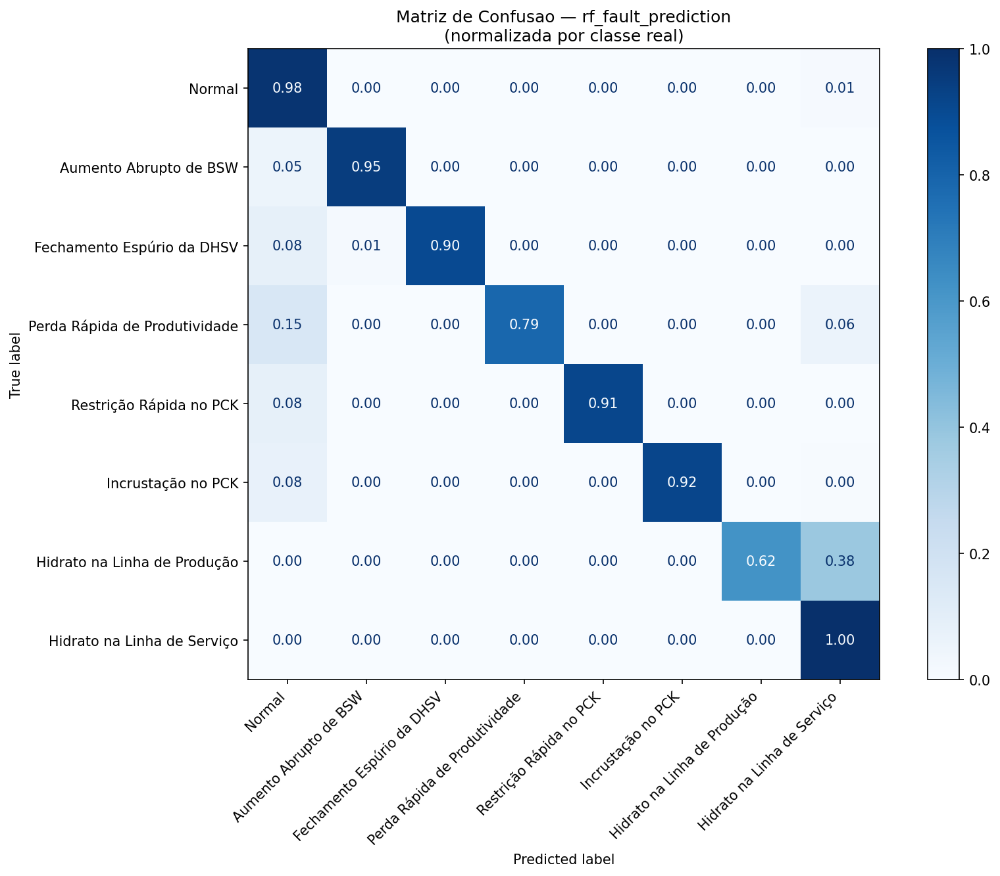
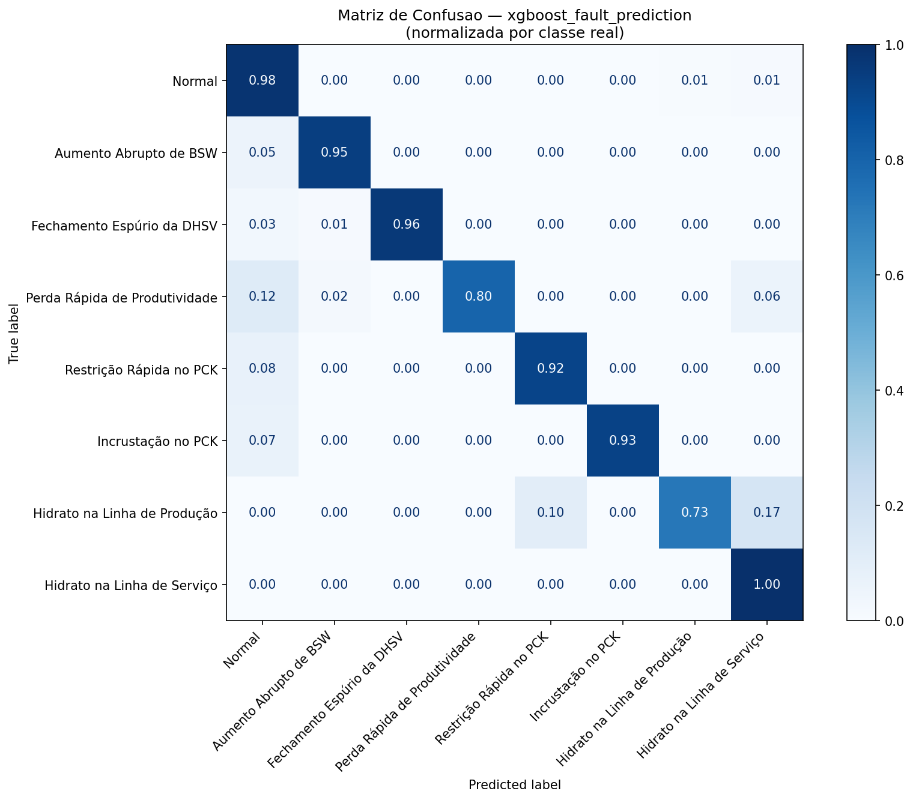
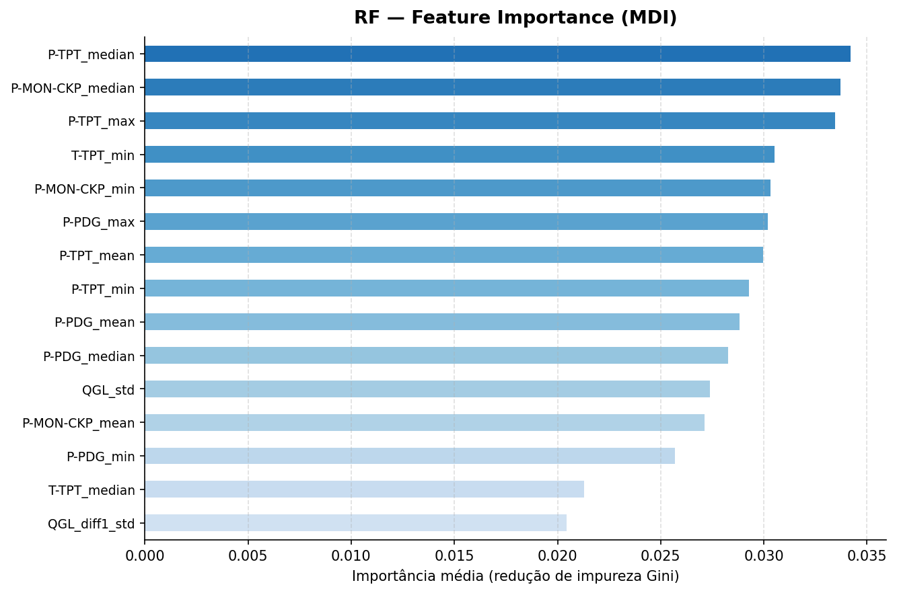
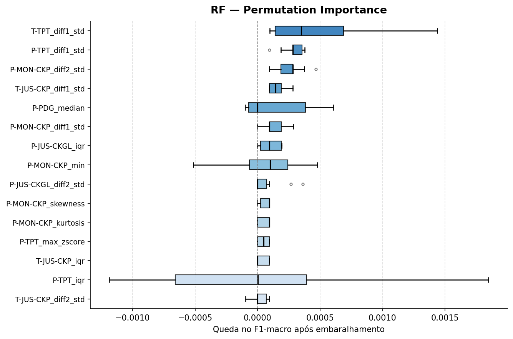
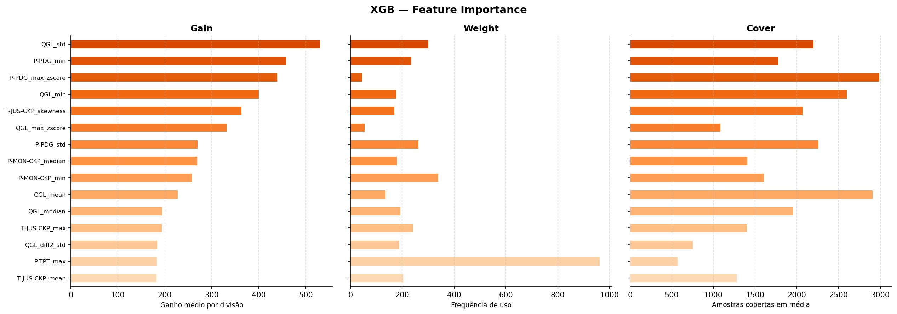
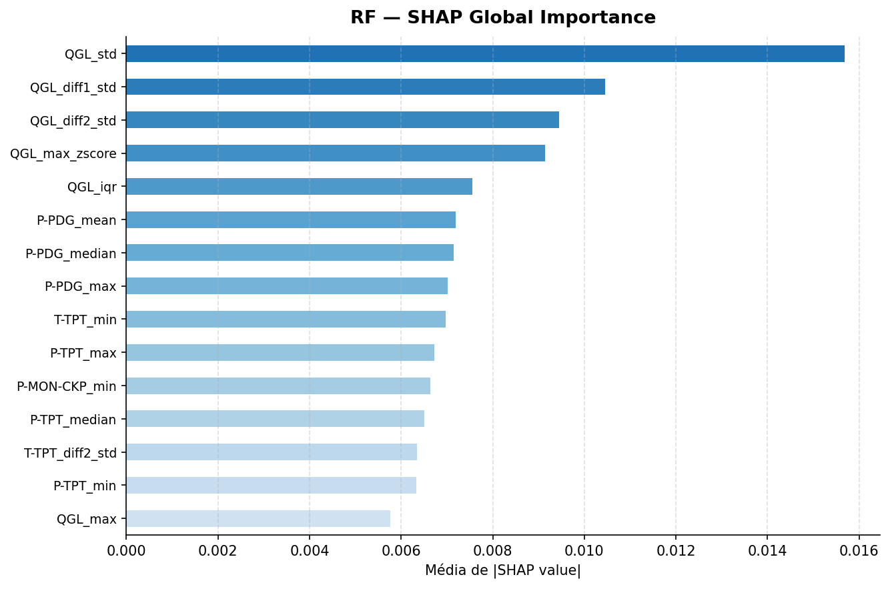
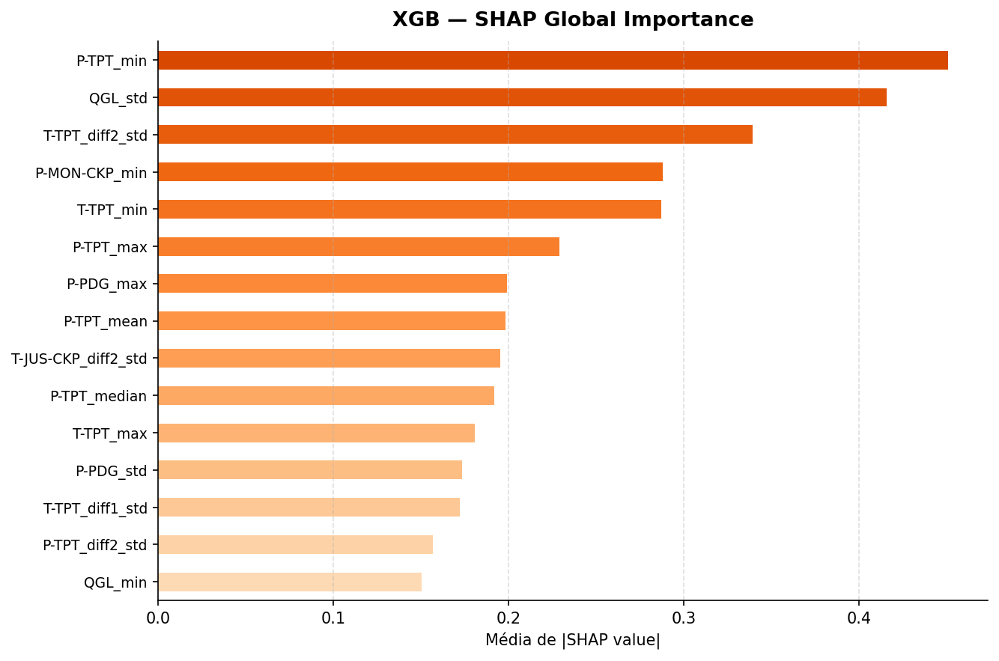

# Previsão de Falha a partir de Operação Normal

## 1. Objetivo

Verificar se é possível prever consistentemente **qual tipo de falha um poço vai desenvolver** usando apenas janelas em que ele ainda está operando normalmente.

## 2. Metodologia

### 2.1 Filtro de janelas

Somente janelas com `window_label == 0` (operação normal) foram utilizadas. Janelas transientes e com eventos ativos de falha foram descartadas. Isso resulta em **102.040 janelas** de **1.117 instâncias**.

### 2.2 Rótulo de predição

O rótulo de cada janela é a `fault_class` da instância à qual ela pertence, ou seja, o tipo de falha que aquele poço irá desenvolver. São 8 classes disponíveis:

| Classe | Evento |
|--------|--------|
| 0 | Operação normal (poço nunca desenvolve falha) |
| 1 | Aumento Abrupto de BSW |
| 2 | Fechamento Espúrio da DHSV |
| 5 | Perda Rápida de Produtividade |
| 6 | Restrição Rápida no PCK |
| 7 | Incrustação no PCK |
| 8 | Hidrato na Linha de Produção |
| 9 | Hidrato na Linha de Serviço |

> Classes 3 (Golfadas) e 4 (Instabilidade de Fluxo) estão ausentes pois suas instâncias no 3W não possuem período de operação normal gravado.

### 2.3 Features

11 features estatísticas extraídas de janelas de 300s, **sem filtragem de sinal**, sobre os 8 sensores do poço, resultando em 88 features por janela.

| Sensor | Descrição física |
|--------|-----------------|
| P-PDG | Pressão no sensor de fundo do poço |
| T-PDG | Temperatura no sensor de fundo |
| P-TPT | Pressão no topo da árvore de natal molhada |
| T-TPT | Temperatura no topo da árvore |
| P-MON-CKP | Pressão a montante do choke de produção |
| T-JUS-CKP | Temperatura a jusante do choke de produção |
| P-JUS-CKGL | Pressão a jusante do choke de gás lift |
| QGL | Vazão de gás lift |

| Feature | Fórmula / Descrição |
|---------|---------------------|
| `mean` | Média aritmética |
| `std` | Desvio padrão |
| `min` | Mínimo |
| `max` | Máximo |
| `median` | Mediana |
| `iqr` | Interquartil (Q75–Q25) |
| `skewness` | Assimetria da distribuição |
| `kurtosis` | Curtose da distribuição |
| `diff1_std` | Desvio padrão da 1ª derivada |
| `diff2_std` | Desvio padrão da 2ª derivada |
| `max_zscore` | max(\|x − μ\| / σ) | 

### 2.4 Busca de Hiperparâmetros

`RandomizedSearchCV` com 20 iterações e `GroupKFold(n_splits=5)`, otimizando F1-macro.

**Random Forest - espaço de busca:**

| Hiperparâmetro | Valores |
|----------------|---------|
| `n_estimators` | 100, 200, 300 |
| `max_depth` | None, 10, 20, 30 |
| `min_samples_leaf` | 1, 2, 4 |
| `max_features` | sqrt, log2 |

Melhor configuração: `n_estimators=200`, `max_depth=10`, `max_features=log2`, `min_samples_leaf=1`

**XGBoost - espaço de busca:**

| Hiperparâmetro | Valores |
|----------------|---------|
| `n_estimators` | 100, 200, 300, 500 |
| `max_depth` | 3, 4, 6, 8 |
| `learning_rate` | 0,01, 0,05, 0,1, 0,2 |
| `subsample` | 0,7, 0,8, 1,0 |
| `colsample_bytree` | 0,7, 0,8, 1,0 |
| `min_child_weight` | 1, 3, 5 |

Melhor configuração: `n_estimators=200`, `max_depth=8`, `learning_rate=0.1`, `subsample=1.0`, `colsample_bytree=0.7`, `min_child_weight=3`

### 2.5 Validação

`GroupKFold(n_splits=5)` por `instance_id`, garantindo que janelas do mesmo poço nunca aparecem simultaneamente em treino e teste.

---

## 3. Resultados

### 3.1 Métricas Globais

| Métrica | Random Forest | XGBoost |
|---------|:---:|:---:|
| F1-macro (OOF) | 0,9148 | **0,9262** |
| F1-weighted | 0,9538 | **0,9620** |
| Acurácia | 0,9554 | **0,9627** |

### 3.2 F1 por Classe

| Classe | Evento | RF | XGBoost |
|--------|--------|----|---------|
| 0 | Normal | 0,979 | **0,981** |
| 1 | BSW | **0,970** | 0,966 |
| 2 | DHSV | 0,914 | **0,979** |
| 5 | Prod. Rápida | 0,873 | **0,886** |
| 6 | PCK Restrição | **0,955** | 0,868 |
| 7 | PCK Incrustação | 0,950 | **0,959** |
| 8 | Hidrato Produção | 0,744 | **0,809** |
| 9 | Hidrato Serviço | 0,934 | **0,961** |

O XGBoost supera o RF em 6 das 8 classes. A maior diferença está na **Fechamento Espúrio da DHSV (+0,065)** e no **Hidrato na Linha de Produção (+0,065)**. O RF leva vantagem apenas em **Aumento Abrupto de BSW (+0.004)** e **Restrição Rápida no PCK (+0.087)**.

### 3.3 Matrizes de Confusão

Compara os rótulos preditos pelos modelos com o rótulo real de cada amostra. Os valores são normalizados por linha: cada célula mostra a fração das amostras daquela classe real que foi predita como cada classe.

| RF | XGBoost |
|:---:|:---:|
|  |  |

---

## 4. Interpretabilidade

Quatro métodos foram utilizados para entender quais features mais contribuem para as predições:

### 4.1 Random Forest - Mean Decrease in Impurity (MDI)

Mede o quanto cada feature reduz a impureza (Gini) em média ao longo de todas as árvores. É rápido e embutido no modelo, mas tende a favorecer features com alta variância ou muitas categorias.

### 4.2 Random Forest - Permutation Importance

Embaralha os valores de cada feature e mede a queda no F1-macro. Mais robusto que o MDI para features correlacionadas, mas computacionalmente mais caro (10 repetições, amostra de 10.000 janelas). O boxplot mostra a distribuição das 10 execuções.

 O topo é dominado por features de variação temporal (`diff1_std` e `diff2_std`), contrastando com o MDI onde features estáticas têm peso maior. Features com caixa cruzando zero (como `P-TPT_iqr`) têm importância instável e provavelmente não contribuem de forma confiável. Features com grandes intervalos IQR indicam sensibilidade ao subconjunto de dados.

### 4.3 XGBoost - Feature Importance

O XGBoost tem três métricas nativas de importância, que medem aspectos diferentes do papel de cada feature nas árvores:

- **Gain:** ganho médio de acurácia por divisão que usou aquela feature.
- **Weight:** quantas vezes a feature aparece como critério de divisão.
- **Cover:** número médio de amostras cobertas pelas divisões que usam aquela feature.

### 4.4 SHAP: SHapley Additive exPlanations

Calcula a contribuição marginal de cada feature para cada predição individual. Os valores exibidos são a média de |SHAP value| sobre todas as amostras e todas as classes, uma medida de importância global independente de modelo.

> Para uma análise mais detalhada, podemos plotar os gráficos SHAP para cada classe individualmente.

| RF | XGBoost |
|:---:|:---:|
|  |  |

**Observação:** No Random Forest, o SHAP é calculado sobre as probabilidades de saída (valores entre 0 e 1). No XGBoost com `multi:softmax`, o SHAP é calculado sobre a saída bruta do modelo (espaço de log-odds), que é ilimitada e tem magnitude maior. Os dois gráficos não são comparáveis em escala absoluta, apenas o ranking das features importa na comparação entre modelos.